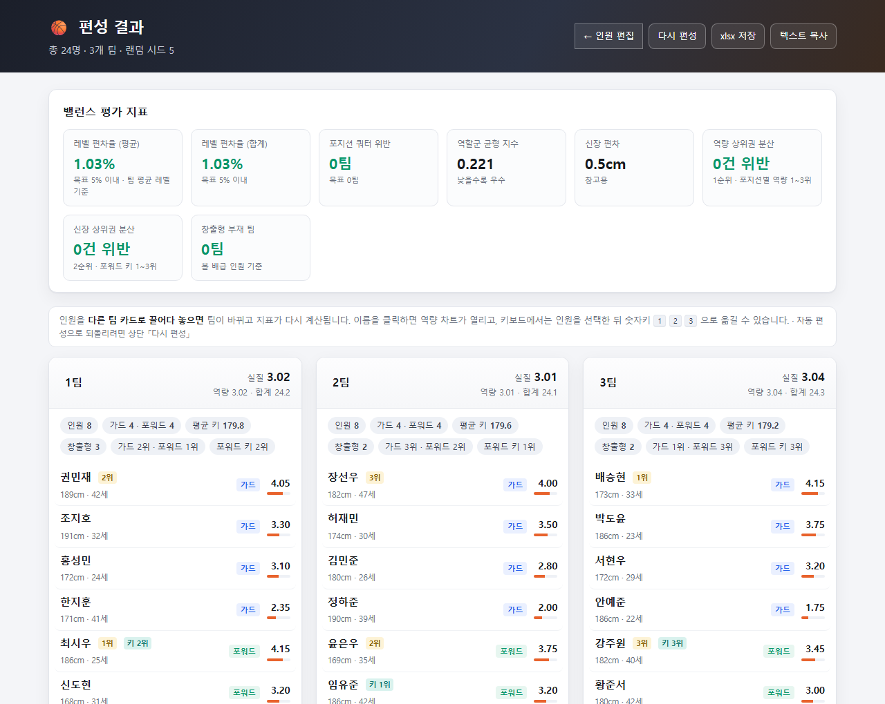
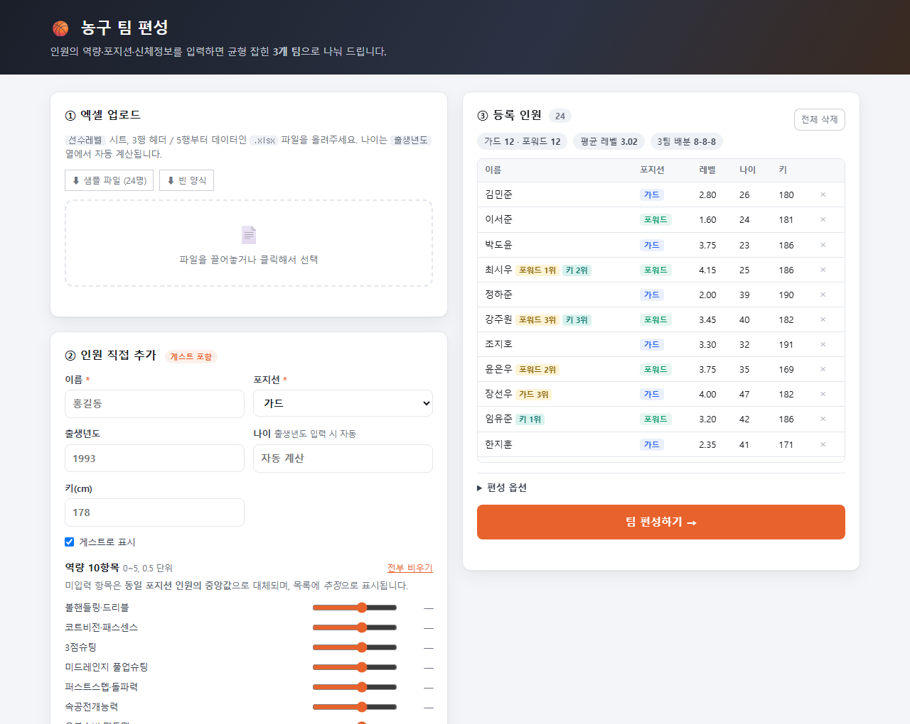
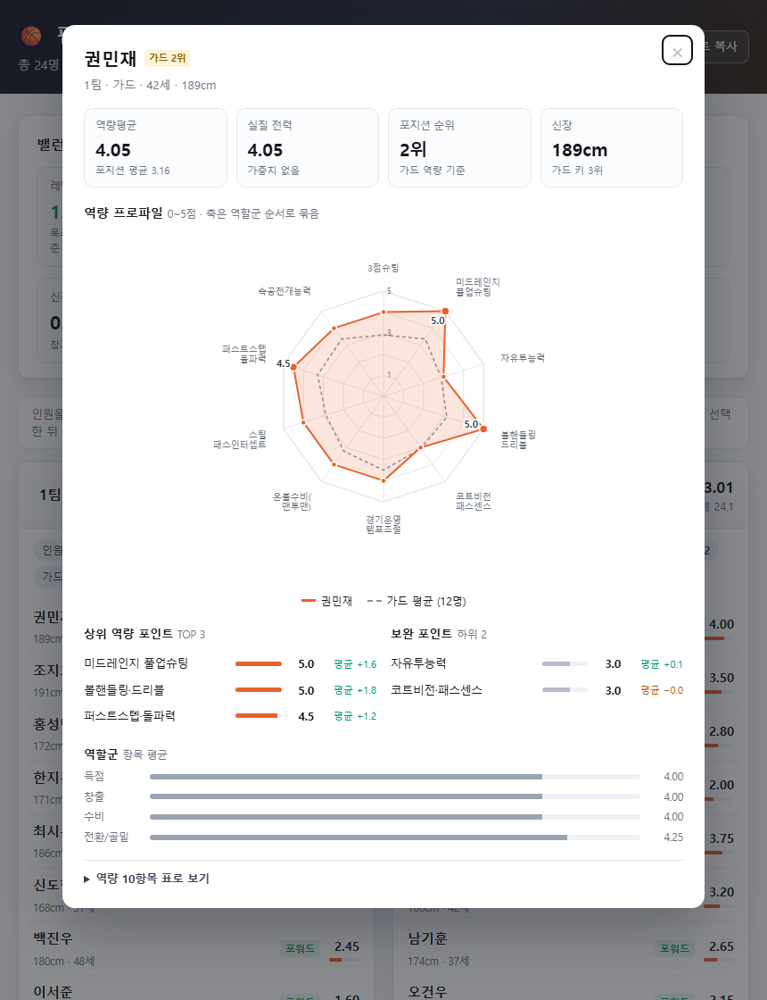

# 🏀 농구 동호회 팀 편성 웹앱

동호회 인원의 역량·포지션·신체정보를 넣으면 **균형 잡힌 3개 팀**으로 자동 편성해 주는
로컬 웹 애플리케이션입니다. 픽업 게임 전에 "누가 어느 팀?"으로 실랑이하지 않으려고 만들었습니다.

단순히 점수 합계만 맞추지 않고, **포지션 구성 · 역할군(득점/창출/수비/골밑) 분포 · 평균 신장 ·
에이스 분산 · 시니어 가중치**를 함께 고려한 다목적 최적화로 나눕니다.

| | |
|---|---|
| **입력** | 엑셀 업로드(포지션별 역량 자동 분기 양식) 또는 웹 폼 직접 입력 |
| **편성** | 상위권 분산 배치 → 그리디 초기해 → Hill Climbing 스왑 최적화 |
| **결과** | 팀별 명단·요약·역할군 프로파일, 밸런스 평가 지표, 인원별 레이더 차트, 드래그로 수동 조정 |
| **스택** | Python + FastAPI / 순수 HTML·CSS·JS (빌드 도구 없음) |

<p align="center">
  
</p>

<p align="center">
  
  
</p>

> 화면의 인원 데이터는 모두 프로그램이 만든 **샘플**입니다.

이 저장소는 세 개의 스펙 문서 — `SPEC.md`(데이터 스키마) · `TEAM_BALANCE_SPEC.md`(편성 알고리즘) ·
`WEBAPP_SPEC.md`(제품 요구사항) — 를 구현한 결과물입니다.

## 실행

```bat
pip install -r requirements.txt
run.bat
```

또는 직접 실행:

```bat
python -m uvicorn main:app --app-dir backend --host 127.0.0.1 --port 8000
```

브라우저에서 <http://127.0.0.1:8000> 접속. API 문서는 `/docs`.

## 폴더 구조

```
C:\AI\AICoding2\
├─ backend\
│  ├─ main.py        FastAPI 진입점 · API (WEBAPP_SPEC.md §5)
│  ├─ models.py      인원/팀/옵션 데이터 모델 (SPEC.md §3)
│  ├─ skills.py      역량 10항목 정의 + 역할군 매핑 (SPEC.md §2, BALANCE §2)
│  ├─ parser.py      xlsx 파싱 (SPEC.md §1~2) · 중앙값 대체 (BALANCE §6)
│  ├─ ranking.py     나이 가중치 · 역량/신장 순위와 분산 제약 (BALANCE §4.0/§4.5)
│  ├─ sample_sheet.py  샘플/빈 양식 xlsx 생성 (다운로드 버튼이 사용)
│  ├─ balancer.py    그리디 배정 → Hill Climbing 스왑 최적화 (BALANCE §4)
│  └─ evaluator.py   팀 요약 · 밸런스 평가 지표 (BALANCE §5)
├─ frontend\
│  ├─ index.html     인원 업로드/입력 화면
│  ├─ result.html    3개 팀 결과 화면
│  └─ static\        style.css, app.js, result.js, member-sheet.js(역량 차트)
├─ tools\
│  ├─ make_sample_xlsx.py  샘플 엑셀을 파일로 저장하는 CLI 래퍼
│  └─ smoke_test.py        API 전체 흐름 스모크 테스트
├─ docs\             README용 화면 캡처
├─ sample\           생성된 샘플 엑셀 (저장소에는 포함하지 않음)
└─ requirements.txt
```

## 사용 흐름

0. **양식 받기** — 입력 화면 ① 카드의 `⬇ 샘플 파일 (24명)` / `⬇ 빈 양식` 버튼으로
   현재 스펙에 맞는 xlsx를 내려받을 수 있습니다.
1. **엑셀 업로드** — `선수레벨` 시트, 3행 헤더 / 4행 예시행(제외) / 5행부터 데이터.
   빈 이름 행을 만나면 파싱을 종료합니다. Z열(역량평균)이 비어 있으면 10항목 평균으로 계산합니다.
2. **인원 직접 추가** — 이름·포지션은 필수, 출생년도·키는 선택. 출생년도를 넣으면 나이가
   자동으로 채워집니다. 포지션을 고르면 해당 역량 10항목 슬라이더(0~5, 0.5 단위)가
   나타나고, 손대지 않은 항목은 미입력으로 처리됩니다.
3. **팀 편성하기** — 3팀으로 분할합니다(나머지는 라운드로빈, 인원수 차 최대 1명).
4. **결과 화면** — 팀별 명단·요약·역할군 프로파일, 상단에 평가 지표. 팀 이름은 클릭해서
   수정할 수 있고, `다시 편성`(새 시드) · `xlsx 저장` · `텍스트 복사`를 지원합니다.
5. **인원별 역량 차트** — 명단에서 이름을 클릭하면 상세 시트가 열립니다 (아래 참고).
6. **수동 팀 이동** — 인원을 다른 팀 카드로 끌어다 놓으면 팀이 바뀌고 지표가 다시 계산됩니다.

### 템플릿 엑셀의 포지션별 분기

포지션(E열)을 고르면 그 포지션의 역량 블록만 살아납니다.

| 포지션 | 입력하는 블록 | 가려지는 블록 | 역량평균(Z) |
|---|---|---|---|
| 가드 | F~O (가드 10항목) | P~Y | `AVERAGE(F:O)` |
| 포워드 | P~Y (포워드 10항목) | F~O | `AVERAGE(P:Y)` |
| (비어 있음) | — | 양쪽 모두 | 빈칸 |

- 가려짐은 **조건부 서식**(회색 배경 + 배경색 글자)이고, 반대쪽 블록에 값을 넣으려 하면
  **데이터 유효성 검사**가 거부합니다. 포지션 자체는 드롭다운으로 고릅니다.
- 역량 점수는 0~5, 0.5 단위만 통과합니다.
- 수식·서식·유효성 검사는 **104행까지** 미리 깔려 있어 인원을 그냥 이어서 적으면 됩니다.
- 실제 Excel에서 재계산해 확인한 동작: 가드 행 2.8 → 포지션을 포워드로 바꾸면 빈칸 →
  포워드 블록을 채우면 그 평균으로 갱신.

### 나이는 출생년도로 자동 계산

입력 파일의 열 구성은 `A 이름 / B 출생년도 / C 나이 / D 키(cm) / E 포지션 /
F~O 가드 역량 / P~Y 포워드 역량 / Z 역량평균` 입니다 (SPEC.md §2).

`나이`(C열)는 직접 입력하지 않고 수식으로 계산됩니다.

```excel
=IF(B5="","",YEAR(TODAY())-B5)
```

파일을 열 때마다 그 해 기준으로 갱신되며, 행을 추가할 때는 C열·Z열 수식을 아래로
복사하세요. 서버는 openpyxl로 값을 읽어 수식 캐시값이 없을 수 있으므로, **출생년도가
있으면 나이 셀을 무시하고 서버의 현재 연도로 다시 계산**합니다.

파서는 3행 헤더의 컬럼명으로 열을 찾기 때문에 **출생년도 열이 없던 예전 파일도 그대로
읽힙니다**(이 경우 나이 열 값을 사용하고 경고 메시지를 표시).

샘플 파일은 웹 화면의 다운로드 버튼(`GET /api/sample`)으로 받는 것이 가장 간단하며,
요청 시점에 생성하므로 나이 수식의 기준 연도와 열 구성이 항상 최신입니다.
파일로 만들어 두려면:

```bat
python tools\make_sample_xlsx.py                          :: sample\basketball_level_sheet.xlsx (24명)
python tools\make_sample_xlsx.py sample\양식.xlsx 0        :: 데이터 없는 빈 양식
```

## 수동 팀 이동 (드래그 앤 드롭)

결과 화면에서 인원을 **다른 팀 카드로 끌어다 놓으면** 팀이 바뀌고, 팀 요약·평가 지표·경고가
즉시 다시 계산됩니다. 키보드에서는 인원을 선택한 뒤 숫자키 `1` `2` `3` 으로 옮깁니다.

- 재계산은 서버(`POST /api/teams/rearrange`)에서 **자동 편성과 똑같은 `evaluator`** 로 수행합니다.
  편성 알고리즘은 다시 돌리지 않고 받은 배치를 평가만 하므로, 옮긴 결과가 그대로 유지됩니다.
- 제약을 깨는 이동(예: 역량 1위와 2위를 같은 팀에)도 막지 않습니다. 대신 지표 카드가 빨갛게
  바뀌고 경고 문구가 붙어 **무엇이 나빠졌는지** 보여줍니다.
- 조정 상태에서는 상단에 `수동 조정됨` 배지가 붙고, 그 결과가 저장되어 새로고침해도 유지되며
  xlsx 저장·텍스트 복사에도 반영됩니다. 「다시 편성」을 누르면 자동 편성으로 되돌아갑니다.
- 팀이 비게 되거나 인원이 중복 배정되는 요청은 400으로 거부합니다.
- 드래그로 끝난 동작에서는 역량 차트가 열리지 않습니다(클릭과 구분).

## 인원별 역량 차트

결과 화면 명단에서 인원을 클릭(또는 Tab → Enter)하면 상세 시트가 열립니다.

- **다각형(레이더) 차트** — 역량 10항목을 0~5 척도로. 축은 역할군(득점 → 창출 → 수비 →
  전환/골밑) 순서로 묶어 배치해 프로파일의 치우침이 형태로 드러납니다.
  주황 실선(본인) 위에 **동일 포지션 평균**을 회색 파선으로 겹쳐 기준선을 함께 봅니다.
- **상위 역량 포인트 TOP 3 / 보완 포인트 하위 2** — 값과 포지션 평균 대비 차이(±)를 함께 표시.
  차트에는 상위 3개만 직접 라벨을 붙입니다(모든 꼭짓점에 숫자를 찍지 않음).
- 요약 타일(역량평균 / 실질 전력 / 포지션 순위 / 신장), 역할군 4종 막대, 꼭짓점 호버 툴팁,
  그리고 색에만 의존하지 않도록 **`역량 10항목 표로 보기`** 표를 함께 제공합니다.
- 역량 미입력(추정) 인원은 값이 포지션 중앙값이라 평균선과 거의 겹치며, 그 사실을 배너로 알립니다.
- `/result?member=<인원id>` 로 특정 인원의 차트를 바로 열 수 있습니다(링크 공유용).

> 색 사용: 본인은 강조색 실선 + 옅은 채움, 기준선은 무채색 파선입니다. 두 계열은 색 외에
> 실선/파선과 채움 유무로도 구분되고 범례가 항상 붙으므로 색각 이상에서도 구분됩니다.
> (두 색의 CVD ΔE 14.1 / 일반 시야 ΔE 19.0 — 모두 기준 통과)

## 편성 알고리즘

`TEAM_BALANCE_SPEC.md` §4를 그대로 구현했습니다.

0. **상위권 분산 배치**: 1순위(가드·포워드 각 역량 1·2·3위) → 2순위(포워드 키
   1·2·3위) 순서로 서로 다른 팀에 하나씩 먼저 앉힙니다 (BALANCE §4.5).
1. **초기해 — 그리디 최소편차 배정**: 나머지를 실질 전력 내림차순으로 정렬하고,
   포지션 쿼터(±1명)를 만족하는 팀 중 현재 총점이 가장 낮은 팀에 배정합니다.
   쿼터를 지킬 수 있는 팀이 없으면 제약을 완화(fallback)합니다.
2. **최적화 — Hill Climbing**: 서로 다른 두 팀에서 무작위 1명씩 골라 교환하고, 아래
   목적함수가 개선될 때만 채택합니다(기본 3,000회).

```
cost = Var(팀 평균 실질전력)
     + λ1 · Var(팀 가드 비율)
     + λ2 · Σ Var(역할군 4종 평균) / 4
     + λ3 · Var(팀 평균 신장 / 10)
     +  2.0 · 포지션 쿼터 위반 팀 수
     +  3.0 · 창출형 인원 0명 팀 수
     + 10.0 · 역량 상위권 분산 위반 건수   ← 1순위, 사실상 하드 제약
     +  5.0 · 신장 상위권 분산 위반 건수   ← 2순위, 충돌 시 이쪽을 양보
```

### 55세 이상 가중치 0.5점

경기 보너스를 전력으로 환산해 **실질 전력 = 역량평균 + 0.5**(55세 이상)로 놓고
밸런싱합니다. 목적함수·팀 요약·평가 지표가 모두 이 값 기준입니다.

- 나이 미상은 보너스 0. 기준 나이·보너스 점수는 `age_bonus_from` / `age_bonus`로 조정.
- **순위 계산에는 보너스를 넣지 않습니다** — 상위권 분산은 순수 역량 순위 기준입니다.
- 화면에는 `+1` 배지와 함께 역량평균·실질전력을 나란히 보여줍니다.

### 상위권 분산 (우선순위 2단계)

| 순위 | 제약 | 대상 |
|---|---|---|
| 1순위 | 역량 1·2·3위를 서로 다른 팀에 | 가드, 포워드 각각 |
| 2순위 | 키 1·2·3위를 서로 다른 팀에 | 포워드 |

- 순위는 순수 값 기준입니다 — 나이 가중치는 순위를 바꾸지 않습니다.
  동점자는 이름순으로 확정해 같은 입력이면 항상 같은 결과가 나옵니다.
  키가 없는 인원은 신장 순위에서 빠집니다.
- **두 제약이 충돌하면 1순위를 지키고 2순위를 양보합니다.** 페널티 크기(10.0 vs 5.0)가
  곧 우선순위이며, 양보한 경우 위반 건수를 결과 화면 지표와 경고에 표시합니다.
- 화면에는 `가드 1위`(금색), `키 1위`(청록색) 배지로 표시됩니다.

역할군 4종은 `득점 / 창출 / 수비 / 전환·골밑`이며 (BALANCE §2), 창출형은 창출 점수
상위 30% 인원입니다 (BALANCE §4.4). 베이스라인 비교용 스네이크 드래프트는
`balancer.snake_draft()`로 남겨두었습니다.

### 결측 역량 처리

역량을 입력하지 않은 인원은 **동일 포지션 인원들의 항목별 중앙값**으로 채우고
(표본이 없으면 3.0), 화면과 xlsx에 `추정`으로 표시합니다 (BALANCE §6).
중앙값은 인원 목록을 읽을 때마다 최신 인원 기준으로 다시 계산합니다.

## 평가 지표 (결과 화면 상단)

| 지표 | 의미 | 목표 |
|---|---|---|
| 레벨 편차율 (평균) | 팀 평균 **실질전력**의 (최대−최소)/전체평균 | 5% 이내 |
| 레벨 편차율 (합계) | SPEC §5 원 정의(합계 기준) | 팀 인원수가 같을 때만 유효 |
| 역량 상위권 분산 | 1순위 — 포지션별 역량 1~3위가 겹친 건수 | 0 |
| 신장 상위권 분산 | 2순위 — 포워드 키 1~3위가 겹친 건수 | 0 (1순위와 충돌 시 양보) |
| 포지션 쿼터 위반 | 기대 가드 수 대비 ±1명을 벗어난 팀 수 | 0 |
| 역할군 균형 지수 | 역할군 4종 팀간 표준편차의 합 | 낮을수록 우수 |
| 신장 편차 | 팀 평균 신장 최대−최소 | 참고용 |
| 창출형 부재 팀 | 볼 배급 인원이 없는 팀 수 | 0 |

> 인원수가 3으로 나누어떨어지지 않으면 합계 기준 편차율은 인원수 차이만으로도
> 10% 이상 벌어집니다. 이 경우 **평균 기준 편차율**을 보세요. 두 값 모두 API 응답에
> 포함됩니다(`level_deviation_rate`, `level_deviation_rate_avg`).

## API

| 메서드 | 경로 | 설명 |
|---|---|---|
| POST | `/api/upload` | xlsx 업로드 → 파싱 결과 + 전체 인원 + 경고 |
| GET | `/api/members` | 등록 인원 목록(중앙값 대체 적용된 값) |
| POST | `/api/members` | 인원 1명 추가 |
| DELETE | `/api/members/{id}` | 인원 삭제 |
| DELETE | `/api/members` | 전체 삭제 |
| POST | `/api/teams/generate` | 3팀 편성 실행 (options: seed, iterations, use_height, excluded_ids, locked, separate_top_n, separate_height_top_n, height_positions, age_bonus_from, age_bonus) |
| GET | `/api/teams/result` | 마지막 편성 결과 조회 |
| POST | `/api/teams/rearrange` | 손으로 옮긴 팀 구성으로 요약·지표 재계산 (assignment: 팀별 인원 id) |
| POST | `/api/teams/export` | 결과 xlsx 다운로드 |
| GET | `/api/skills` | 포지션별 역량 항목·역할군 정의 |
| GET | `/api/sample` | 샘플 xlsx 다운로드 (`?empty=true` → 빈 양식) |

`excluded_ids`(편성 제외)와 `locked`(`{인원id: 팀번호}` 고정 배정)는 API로만 노출되어
있고 화면 UI는 아직 없습니다.

## 테스트

```bat
python -X utf8 tools\smoke_test.py
```

샘플/양식 다운로드 후 재업로드(왕복) → 업로드 → 게스트 추가(중앙값 대체) → 편성 → 지표 검증 → 시드 재현성 → 제외/고정 배정
→ xlsx 내보내기 → 삭제 → 최소 인원 검증까지 한 번에 확인합니다.

## 데이터 보관

MVP 범위대로 인원 데이터는 **서버 메모리**에만 있습니다. 서버를 재시작하면 사라지므로,
편성 결과가 필요하면 xlsx로 저장해 두세요.

## 데이터 백업

인원 데이터는 서버 메모리에만 있어 재시작하면 사라집니다. 필요할 때
`GET /api/members` 결과를 파일로 받아두면 `POST /api/members` 로 되돌릴 수 있습니다
(`backup/members_backup.json` 이 그 형식의 예시입니다).

## 미구현 (WEBAPP_SPEC.md P2)

- 제외/고정 배정 인원을 지정하는 입력 화면 UI

## 라이선스

MIT — 자유롭게 쓰고 고치셔도 됩니다. 자세한 내용은 [LICENSE](LICENSE).
